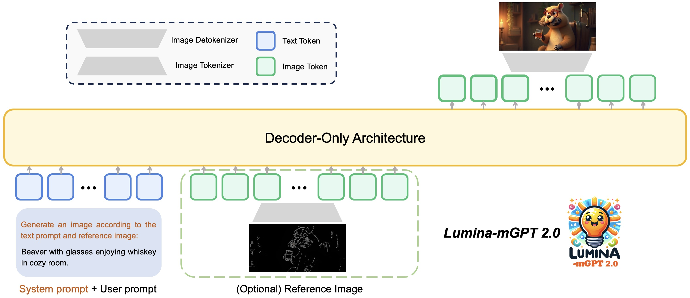
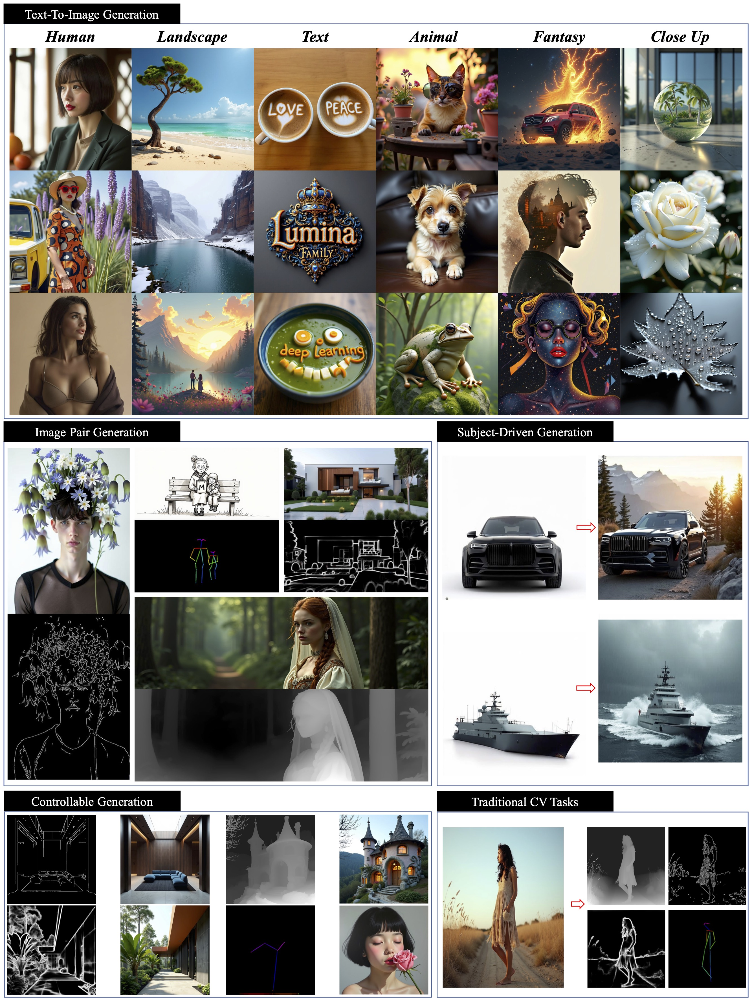

<p align="center">
 
 <br>
</p>

<div align="center">
<h1> Lumina-mGPT 2.0: Stand-Alone AutoRegressive Image Modeling </h1>
 
[](https://arxiv.org/abs/2507.17801)&#160;
[-yellow?logoColor=violet&label=%F0%9F%A4%97%20Lumina-mGPT%202.0%20checkpoints)](https://huggingface.co/Alpha-VLLM/Lumina-mGPT-2.0)&#160;
[-yellow?logoColor=violet&label=%F0%9F%A4%97%20Lumina-mGPT%202.0%20Omni%20checkpoints)](https://huggingface.co/Alpha-VLLM/Lumina-mGPT-2.0-Omni)


<b>¹Shanghai AI Laboratory, &nbsp;  ²Shanghai Innovation Institute, &nbsp; ³The Chinese University of Hong Kong,</b>

<b>⁴Shanghai Jiao Tong University, &nbsp; ⁵Zhejiang University of Technology</b>

</div>

## 📚 Introduction 
We introduce a stand-alone, decoder-only autoregressive model, **trained from scratch**, that unifies a broad spectrum of image generation tasks, including **text-to-image generation, image pair generation, subject-driven generation, multi-turn image editing, controllable generation, and dense prediction**.

<details open>
  <summary>User Demo</summary>
  <video src="https://github.com/user-attachments/assets/7b87eeac-3f20-450c-8df0-a45218acc51d" width="100%"/></video>
</details>
   
<details open>
  <summary>Architecture</summary>
  
</details>


## 🔥 News
**[2025-08-02]** 🎉🎉🎉 We released the inference code for image-to-image tasks and the all-in-one model checkpoints on [HuggingFace](https://huggingface.co/Alpha-VLLM/Lumina-mGPT-2.0-Omni).

**[2025-07-25]** 🎉🎉🎉 We released the technical report on [arXiv](https://arxiv.org/abs/2507.17801).

**[2025-04-03]** 🎉🎉🎉 Lumina-mGPT 2.0 is released!


## 📝 Open-source Plan
 - [x] Text-to-Image / Image Pair Generation Inference & Checkpoints
 - [x] Finetuning code
 - [x] Technical Report
 - [x] All-in-One Inference & Checkpoints
 

## 📽️ Demo Examples
<details open>
  <summary>Qualitative Performance</summary>
 
</details>

<details open>
  <summary>Comparison with Lumina-mGPT and Janus Pro</summary>
  
</details>


## 🚀 Quick Start
### ⚙️ Installation
#### 1. Create a conda environment
```
git clone https://github.com/Alpha-VLLM/Lumina-mGPT-2.0.git && cd Lumina-mGPT-2.0
conda create -n lumina_mgpt_2 python=3.10 -y
conda activate lumina_mgpt_2
```
#### 2. Install  dependencies
```
pip install -r requirements.txt
pip install https://github.com/Dao-AILab/flash-attention/releases/download/v2.7.4.post1/flash_attn-2.7.4.post1+cu12torch2.3cxx11abiFALSE-cp310-cp310-linux_x86_64.whl --no-build-isolation
pip install -e .
```
> Kindly find proper flash-attn version from this [link](https://github.com/Dao-AILab/flash-attention/releases).
#### 3. Download MoVQGAN
Download MoVQGAN weights and put them to the ```lumina_mgpt/movqgan/270M/movqgan_270M.ckpt```.
```
mkdir -p lumina_mgpt/movqgan/270M
wget -O lumina_mgpt/movqgan/270M/movqgan_270M.ckpt https://huggingface.co/ai-forever/MoVQGAN/resolve/main/movqgan_270M.ckpt
```


### ⛽ Text-to-Image Generation 
#### 1. Simple Inference
```
python generate_examples/generate.py \
--model_path Alpha-VLLM/Lumina-mGPT-2.0 --save_path save_samples/ \
--cfg 4.0 --top_k 4096 --temperature 1.0 --width 768 --height 768
```

#### 2. Simple Inference with contol image and prompt
```
python generate_examples/generate_single_prompt_with_image.py.py \
--model_path Alpha-VLLM/Lumina-mGPT-2.0 --save_path save_samples/ \
--cfg 4.0 --top_k 4096 --temperature 1.0 --width 768 --height 768 \
--task depth --input_image_path /path/to/image.jpg \
--prompt "Your prompt text here"
```

#### 3. Accelerate Inference
Provide two acceleration strategies: Speculative Jacobi Decoding (```--speculative_jacobi```) and Model Quantization (```--quant```).
```
python generate_examples/generate.py \
--model_path Alpha-VLLM/Lumina-mGPT-2.0 --save_path save_samples/ \
--cfg 4.0 --top_k 4096 --temperature 1.0 --width 768 --height 768 \
--speculative_jacobi --quant
```

We provide the inference time and GPU memory on one A100 as a reference:
| Method               | Inference Time | Inference GPU Memory | Description |
|----------------------|--------|--------|--------------------|
| Lumina-mGPT 2.0      | 694s   | 80 GB  | ✅ Recommend |
| + speculative_jacobi | 324s     | 79.2 GB  | ✅ Recommend |
| + speculative_jacobi & quant | 304s     | 33.8 GB  |  |

### 🌟 Image-to-Image Inference
You can refer to [sample_i2i.sh](lumina_mgpt/scripts/sample_i2i.sh). We DO NOT recommand speculative_jacobi for image-to-image inference.
```
# controllable generation
python generate_examples/generate.py \
--model_path Alpha-VLLM/Lumina-mGPT-2.0 --save_path save_samples/ \
--cfg 4.0 --top_k 4096 --temperature 1.0 --width 512 --height 1024 --task i2i \
--i2i_task depth --image_path "assets/depth.png" \
--image_prompt "A rubber outdoor basketball. On a sunlit outdoor court, it bounces near a vibrant mural, casting a long shadow on the asphalt as children eagerly chase it."

# subject driven generation
python generate_examples/generate.py \
--model_path Alpha-VLLM/Lumina-mGPT-2.0 --save_path save_samples/ \
--cfg 4.0 --top_k 4096 --temperature 1.0 --width 512 --height 1024 --task i2i \
--i2i_task subject --image_path "assets/subject.png" \
--image_prompt "On a bustling city rooftop at sunset, this item gleams in a tall glass as the skyline silhouettes in the background, the air filled with laughter and clinking glasses."
```

### 💻 Finetuning
Please refer to  [TRAIN.md](TRAIN.md)


## 🤗 Checkpoints
| Model                  | Size | Resolution | pth link | Description |
|------------------------|--------|--------|--------------------|--------------------|
| Lumina-mGPT 2.0        | 7B     | 768px  | [7B](https://huggingface.co/Alpha-VLLM/Lumina-mGPT-2.0)       | Text-to-Image |
| Lumina-mGPT 2.0 (Omni) | 7B     | 768px & 512px (image-to-image)  | [7B-Omni](https://huggingface.co/Alpha-VLLM/Lumina-mGPT-2.0-Omni)       | All-in-One                            |


## 📜 Acknowledgements

**Thanks to the following open-sourced codebase for their wonderful work and codebase!**
- [Lumina-mGPT: Illuminate Flexible Photorealistic Text-to-Image Generation with Multimodal Generative Pretraining](https://github.com/Alpha-VLLM/Lumina-mGPT)
- [Accelerating Auto-regressive Text-to-Image Generation with Training-free Speculative Jacobi Decoding](https://github.com/tyshiwo1/Accelerating-T2I-AR-with-SJD/)
- [Chameleon: Mixed-Modal Early-Fusion Foundation Models](https://github.com/facebookresearch/chameleon)


## 🔥 Open Positions
We are hiring interns and full-time researchers at the Alpha VLLM Group, Shanghai AI Lab. If you are interested, please contact alphavllm@gmail.com.

## 🌟 Star History

[](https://www.star-history.com/#Alpha-VLLM/Lumina-mGPT-2.0&Date)

## 📖 BibTeX

```
@article{xin2025lumina,
  title={Lumina-mGPT 2.0: Stand-Alone AutoRegressive Image Modeling},
  author={Xin, Yi and Yan, Juncheng and Qin, Qi and Li, Zhen and Liu, Dongyang and Li, Shicheng and Huang, Victor Shea-Jay and Zhou, Yupeng and Zhang, Renrui and Zhuo, Le and others},
  journal={arXiv preprint arXiv:2507.17801},
  year={2025}
}
```


